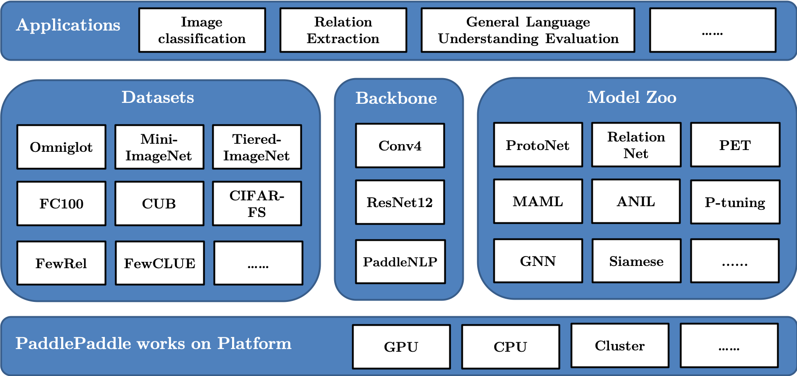

# PaddleFSL
This repository contains PaddleFSL, which is a python library for few-shot learning (FSL) building on top of PaddlePaddle2.0.

PaddleFSL provides low-level utilities and unified interface to create new algorithms for FSL, together with high-quality implementations of existing FSL algorithms and standardized benchmarks. 

<p align="center"></p>

## Overview

- **examples**: using examples of the package, especially high level algorithms including configurations of each task.
- **paddlefsl**: the package code.
  - paddlefsl.backbones: backbones such as MLP, convolutional networks and ResNet.
  - paddlefsl.datasets: class of datasets commenly used in meta-learning.
  - paddlefsl.model_zoo: high-level algorithms in meta-learning.
  - paddlefsl.task_sampler: taskset for splitting specific task of N ways, K shots and Q query points.
  - paddlefsl.utils: Environment and utilities for meta-reinforcement learning.
- **raw_data**: the directory to place the raw data files.
- **test**: unit testing files of the subpackages, functions and classes.

## Installation

To use our package, users should first install paddlepaddle-v2.0.0 or later versions, see https://www.paddlepaddle.org.cn/install .

First, install our required packages.

```bash
# Clone our repository.
git clone https://github.com/tata1661/FSL-Mate.git
# Install requirements.
cd FSL-Mate/PaddleFSL
pip install -r requirements.txt
```

Second, update environment variables.

```bash
# Please edit env.sh to set the correct path of FSL-paddletoolkit directory.
# Then do:
source env.sh
# If you want to use our package frequently, you can add environment variables into .bashrc
cat env.sh >> ~/.bashrc
source ~/.bashrc
```

Finally, check whether the installation is successful.

```bash
# Start a python interpreter
python
>>> import paddlefsl
>>> paddlefsl.__version__
'1.0.0a1'
```

## Datasets

We provide several few shot learning datasets and custom dataset interface. Dataset usages please see raw_data/README.md

## Few Shot Tasks and High level algorithms

We provide implementations of several high level algorithms in different few shot tasks. Please see examples/README.md

## Contributors

PaddleFSL is maintained by Yaqing Wang, Zijing Zhao and Xin Tian. 

Please feel free to open an issue or [contact us](mailto:wangyaqing01@baidu.com) for feedbacks or advices. Thanks!

