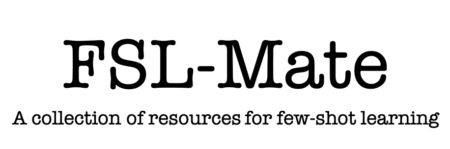

<p align="center"></p>


---

**FSL-Mate** is a collection of resources for few-shot learning (FSL).  

In particular, FSL-Mate currently contains

- [**FewShotPapers**](https://github.com/tata1661/FSL-Mate/tree/master/FewShotPapers): a paper list which tracks the research advances on FSL
- [**PaddleFSL**](https://github.com/tata1661/FSL-Mate/tree/master/PaddleFSL): a PaddlePaddle-based python library for FSL 

We are endeavored to constantly update FSL-Mate. Hopefully, it can make FSL easier. 

## News🔥 

- [2025-04-18] Add FSL papers published in EMNLP 2025 and ICCV 2025.

- [2025-10-14] Add FSL papers published in CVPR 2025, ACL 2025 and IJCAI 2025.

- [2025-07-17] Add FSL papers published in CVPR 2024, ICML 2024, IJCAI 2024, ACL 2024, NeurIPS 2024, EMNLP 2024, ICCV 2024, ICLR 2025, WWW 2024-2025, KDD 2024-2025, AAAI 2024-2025, NAACL 2024-2025, SIGIR 2024-2025.


## Cite Us

Please cite our [paper](https://dl.acm.org/doi/10.1145/3386252?cid=99659542534) if you find it helpful.
```
@article{wang2020generalizing,
  title={Generalizing from a few examples: A survey on few-shot learning},
  author={Wang, Yaqing and Yao, Quanming and Kwok, James T and Ni, Lionel M},
  journal={ACM Computing Surveys},
  volume={53},
  number={3},
  pages={1--34},
  year={2020},
  publisher={ACM New York, NY, USA}
}
```

## Contact
We welcome advices and feedbacks for FSL-Mate. Please feel free to open an issue or contact [Yaqing Wang](mailto:wangyaqing@bimsa.cn). 


